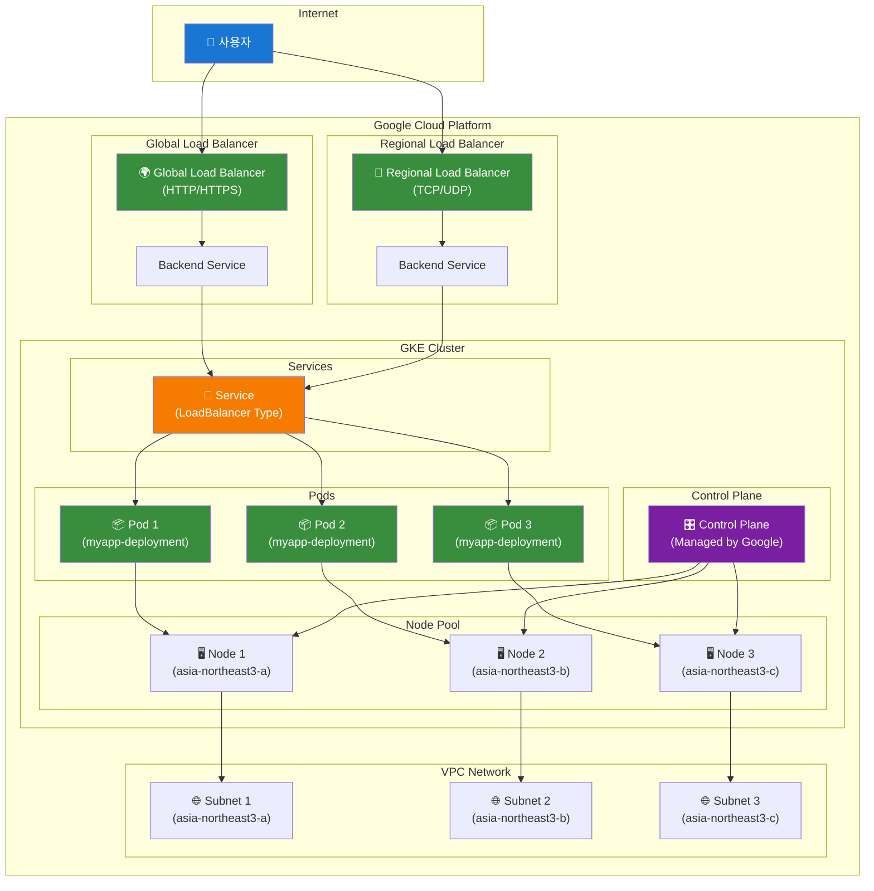
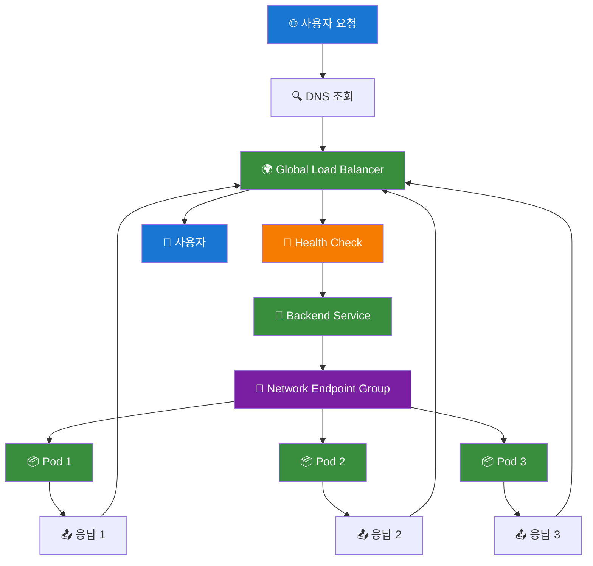

# GKE LoadBalancer 아키텍처 구성도

## 🌐 GKE LoadBalancer 아키텍처



## 🏗️ GKE LoadBalancer 타입별 구성

### 1. External LoadBalancer (기본)

```yaml
apiVersion: v1
kind: Service
metadata:
  name: myapp-service-gke-lb
  annotations:
    cloud.google.com/load-balancer-type: "External"
spec:
  type: LoadBalancer
  ports:
  - port: 80
    targetPort: 80
  selector:
    app: myapp
```

### 2. Internal LoadBalancer

```yaml
apiVersion: v1
kind: Service
metadata:
  name: myapp-service-internal-lb
  annotations:
    cloud.google.com/load-balancer-type: "Internal"
    networking.gke.io/load-balancer-subnet: "subnet-name"
spec:
  type: LoadBalancer
  ports:
  - port: 80
    targetPort: 80
  selector:
    app: myapp
```

### 3. Global LoadBalancer (HTTP/HTTPS)

```yaml
apiVersion: v1
kind: Service
metadata:
  name: myapp-service-global-lb
  annotations:
    cloud.google.com/load-balancer-type: "External"
    networking.gke.io/load-balancer-type: "Global"
spec:
  type: LoadBalancer
  ports:
  - port: 80
    targetPort: 80
  selector:
    app: myapp
```

## 🔧 GKE LoadBalancer 설정 옵션

### 1. 백엔드 서비스 설정

```yaml
apiVersion: v1
kind: Service
metadata:
  name: myapp-service-advanced
  annotations:
    cloud.google.com/load-balancer-type: "External"
    cloud.google.com/backend-config: '{"default": "myapp-backend-config"}'
    cloud.google.com/neg: '{"ingress": true}'
spec:
  type: LoadBalancer
  ports:
  - port: 80
    targetPort: 80
  selector:
    app: myapp
```

### 2. BackendConfig 리소스

```yaml
apiVersion: cloud.google.com/v1
kind: BackendConfig
metadata:
  name: myapp-backend-config
spec:
  healthCheck:
    checkIntervalSec: 10
    timeoutSec: 5
    healthyThreshold: 2
    unhealthyThreshold: 3
    path: "/health"
    port: 8080
  sessionAffinity:
    affinityType: "CLIENT_IP"
  connectionDraining:
    drainingTimeoutSec: 60
```

### 3. NEG (Network Endpoint Group) 설정

```yaml
apiVersion: v1
kind: Service
metadata:
  name: myapp-service-neg
  annotations:
    cloud.google.com/load-balancer-type: "External"
    cloud.google.com/neg: '{"ingress": true}'
    cloud.google.com/backend-config: '{"default": "myapp-backend-config"}'
spec:
  type: LoadBalancer
  ports:
  - port: 80
    targetPort: 80
  selector:
    app: myapp
```

## 🌍 GKE LoadBalancer 트래픽 흐름



## 🛠️ GKE LoadBalancer 실습 가이드

### 1. 기본 External LoadBalancer 배포

```bash
# 1. 기본 LoadBalancer 서비스 생성
kubectl apply -f service-gke-loadbalancer.yaml

# 2. External IP 확인
kubectl get service myapp-service-gke-lb -n day1-practice

# 3. 접근 테스트
curl http://[EXTERNAL_IP]
```

### 2. Internal LoadBalancer 배포

```bash
# 1. Internal LoadBalancer 서비스 생성
kubectl apply -f service-gke-internal-lb.yaml

# 2. Internal IP 확인
kubectl get service myapp-service-internal-lb -n day1-practice

# 3. VPC 내부에서 접근 테스트
curl http://[INTERNAL_IP]
```

### 3. Global LoadBalancer 배포

```bash
# 1. Global LoadBalancer 서비스 생성
kubectl apply -f service-gke-global-lb.yaml

# 2. Global IP 확인
kubectl get service myapp-service-global-lb -n day1-practice

# 3. 전 세계에서 접근 테스트
curl http://[GLOBAL_IP]
```

## 📊 GKE LoadBalancer 모니터링

### 1. LoadBalancer 상태 확인

```bash
# 서비스 상태 확인
kubectl get service -n day1-practice

# 백엔드 엔드포인트 확인
kubectl get endpoints -n day1-practice

# Pod 상태 확인
kubectl get pods -n day1-practice
```

### 2. Google Cloud Console에서 확인

```bash
# LoadBalancer 리소스 확인
gcloud compute forwarding-rules list

# 백엔드 서비스 확인
gcloud compute backend-services list

# Health Check 확인
gcloud compute health-checks list
```

## 🔒 GKE LoadBalancer 보안 설정

### 1. 방화벽 규칙 설정

```bash
# LoadBalancer용 방화벽 규칙 생성
gcloud compute firewall-rules create allow-gke-lb \
    --allow tcp:80 \
    --source-ranges 0.0.0.0/0 \
    --target-tags gke-node
```

### 2. SSL/TLS 설정

```yaml
apiVersion: v1
kind: Service
metadata:
  name: myapp-service-ssl
  annotations:
    cloud.google.com/load-balancer-type: "External"
    cloud.google.com/ssl-certificates: "myapp-ssl-cert"
spec:
  type: LoadBalancer
  ports:
  - port: 443
    targetPort: 80
  selector:
    app: myapp
```

## 💰 GKE LoadBalancer 비용 최적화

### 1. 리전별 LoadBalancer 사용

```yaml
# Regional LoadBalancer (비용 절약)
apiVersion: v1
kind: Service
metadata:
  name: myapp-service-regional
  annotations:
    cloud.google.com/load-balancer-type: "External"
    networking.gke.io/load-balancer-type: "Regional"
spec:
  type: LoadBalancer
  ports:
  - port: 80
    targetPort: 80
  selector:
    app: myapp
```

### 2. Internal LoadBalancer 사용

```yaml
# Internal LoadBalancer (VPC 내부만 접근)
apiVersion: v1
kind: Service
metadata:
  name: myapp-service-internal
  annotations:
    cloud.google.com/load-balancer-type: "Internal"
spec:
  type: LoadBalancer
  ports:
  - port: 80
    targetPort: 80
  selector:
    app: myapp
```

## 🚀 GKE LoadBalancer 자동화 스크립트

### 1. LoadBalancer 배포 스크립트

```bash
#!/bin/bash
# GKE LoadBalancer 자동 배포 스크립트

# 클러스터 연결 확인
if ! kubectl get nodes &> /dev/null; then
    echo "GKE 클러스터에 연결되지 않았습니다."
    exit 1
fi

# LoadBalancer 서비스 배포
kubectl apply -f service-gke-loadbalancer.yaml

# External IP 대기
echo "External IP 할당 대기 중..."
for i in {1..12}; do
    EXTERNAL_IP=$(kubectl get service myapp-service-gke-lb -n day1-practice -o jsonpath='{.status.loadBalancer.ingress[0].ip}' 2>/dev/null)
    if [ -n "$EXTERNAL_IP" ]; then
        echo "External IP: $EXTERNAL_IP"
        echo "접근 URL: http://$EXTERNAL_IP"
        break
    else
        echo "대기 중... ($i/12)"
        sleep 10
    fi
done
```

### 2. LoadBalancer 상태 모니터링

```bash
#!/bin/bash
# GKE LoadBalancer 상태 모니터링 스크립트

echo "=== GKE LoadBalancer 상태 ==="
kubectl get service -n day1-practice

echo "=== 백엔드 엔드포인트 ==="
kubectl get endpoints -n day1-practice

echo "=== Pod 상태 ==="
kubectl get pods -n day1-practice

echo "=== Google Cloud LoadBalancer 리소스 ==="
gcloud compute forwarding-rules list
gcloud compute backend-services list
```

이 구성도를 통해 GKE LoadBalancer의 전체 아키텍처와 설정 방법을 이해할 수 있습니다.
