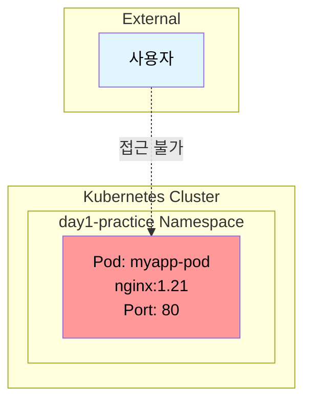
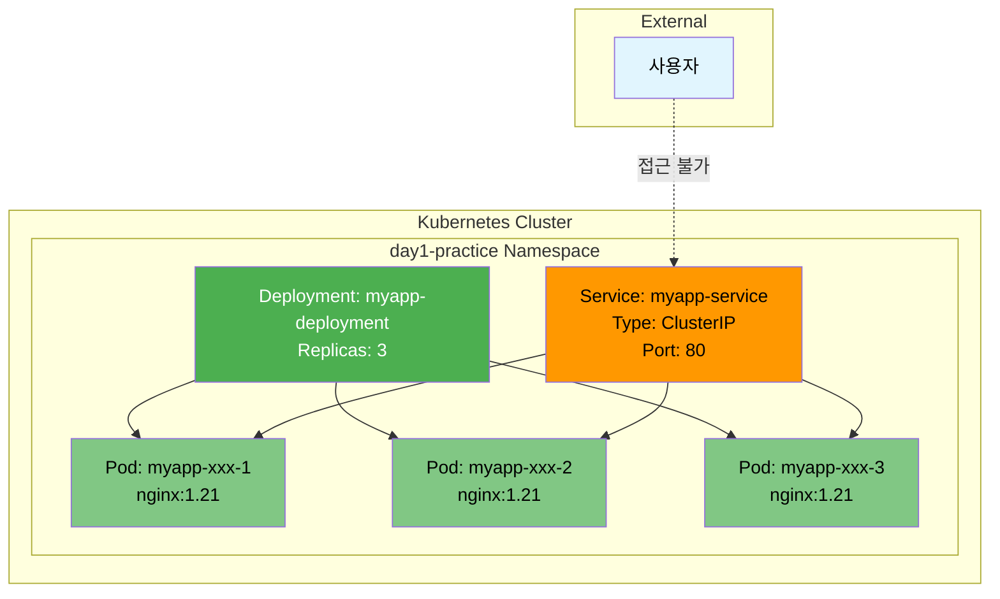
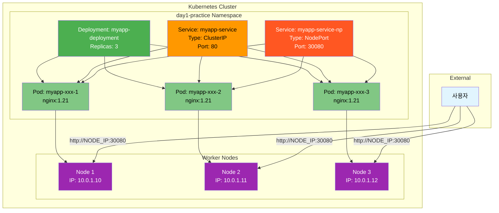
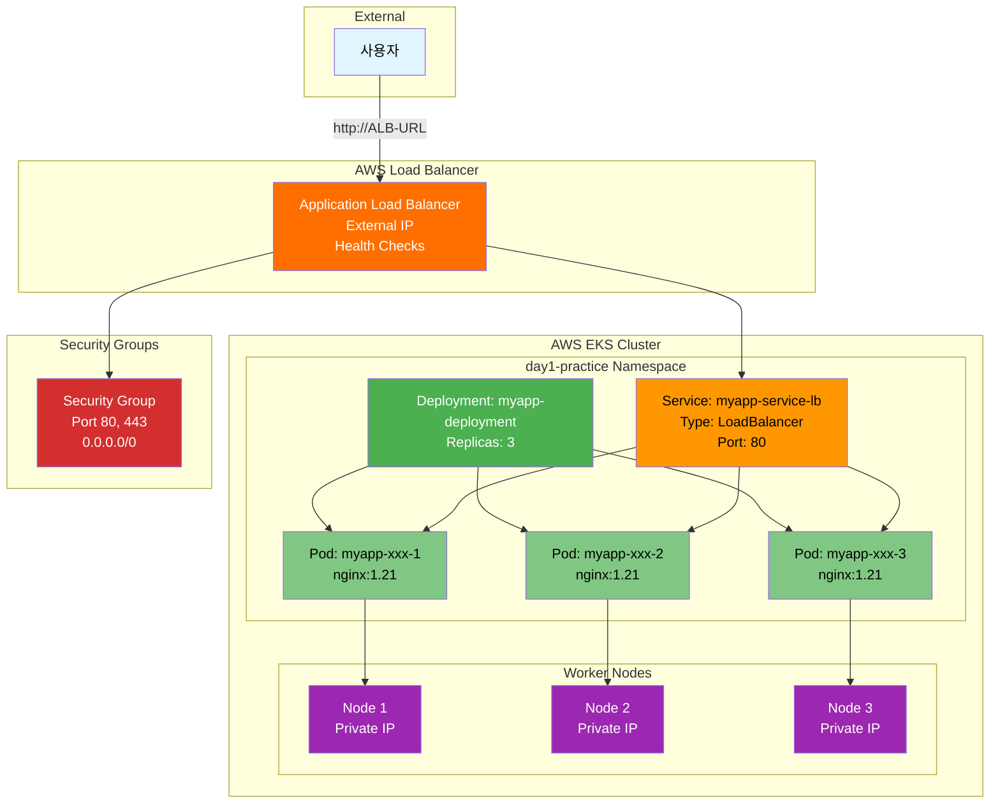
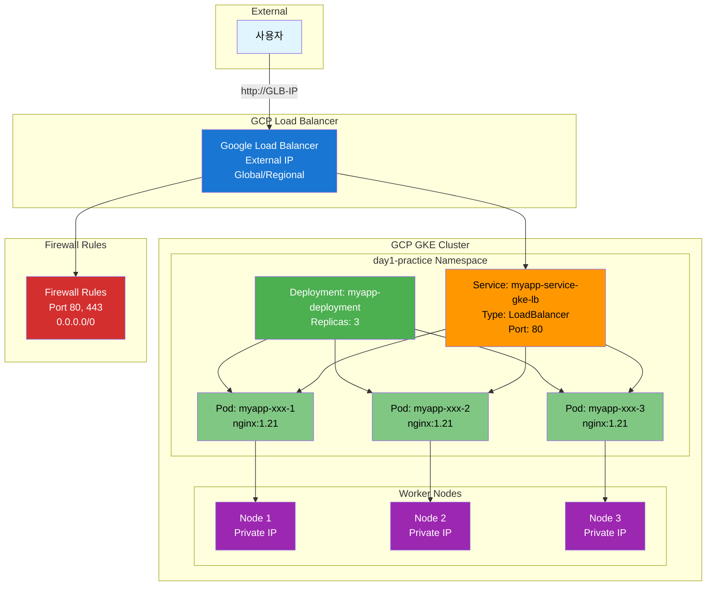
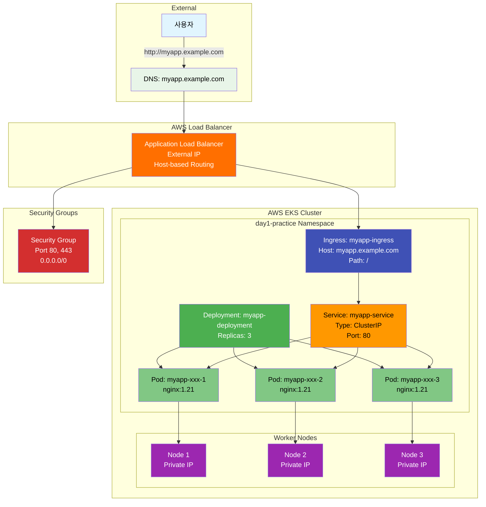

# 🏗️ Kubernetes 아키텍처 진화 과정

## 📊 아키텍처 변화 단계별 다이어그램

### 🔧 1단계: 기본 Pod 배포



**특징**: 
- 단일 Pod만 존재
- 외부 접근 불가능
- Pod 재시작 시 데이터 손실 가능

### 🔧 2단계: Deployment + ClusterIP Service



**특징**:
- 고가용성 (3개 Pod)
- 클러스터 내부에서만 접근 가능
- 로드 밸런싱 제공

### 🔧 3단계: NodePort Service 추가



**특징**:
- 노드 IP를 통한 외부 접근 가능
- 모든 노드에서 동일한 포트로 접근
- 방화벽 설정 필요

### 🔧 4단계: EKS ALB LoadBalancer



**특징**:
- AWS ALB를 통한 외부 접근
- 자동 Health Check
- 보안 그룹 설정 필요
- 고가용성 및 확장성

### 🔧 5단계: GKE GLB LoadBalancer



**특징**:
- GCP GLB를 통한 외부 접근
- Global 또는 Regional 설정 가능
- 방화벽 규칙 설정 필요
- Google Cloud 네이티브 통합

### 🔧 6단계: Ingress 설정 (EKS ALB)



**특징**:
- Host 기반 라우팅
- Path 기반 라우팅 가능
- SSL/TLS 종료 지원
- 고급 로드 밸런싱 기능

## 🔄 아키텍처 진화 요약

### 📊 단계별 비교

| 단계 | 접근 방식 | 특징 | 장점 | 단점 |
|------|-----------|------|------|------|
| 1단계 | Pod만 | 외부 접근 불가 | 단순함 | 고가용성 없음 |
| 2단계 | ClusterIP | 클러스터 내부만 | 안전함 | 외부 접근 불가 |
| 3단계 | NodePort | 노드 IP:포트 | 간단한 외부 접근 | 방화벽 설정 필요 |
| 4단계 | EKS ALB | AWS LoadBalancer | AWS 네이티브 | AWS 의존성 |
| 5단계 | GKE GLB | GCP LoadBalancer | GCP 네이티브 | GCP 의존성 |
| 6단계 | Ingress | 고급 라우팅 | 유연한 라우팅 | 복잡한 설정 |

### 🎯 선택 가이드

#### 개발 환경
- **로컬 테스트**: Pod + ClusterIP
- **팀 공유**: NodePort
- **CI/CD**: Ingress

#### 프로덕션 환경
- **AWS**: EKS + ALB + Ingress
- **GCP**: GKE + GLB + Ingress
- **멀티 클라우드**: Ingress + CDN

### 🛠️ 자동화 도구 활용

```bash
# 아키텍처 단계별 자동 배포
./day1-practice.sh

# 1. K8s 클러스터 컨텍스트 구성 및 체크
# 2. 클러스터 전환 (EKS ↔ GKE)
# 3-6. Pod, Deployment, Service, ConfigMap/Secret
# 7. 전체 K8s 리소스 배포
# 8. LoadBalancer 서비스 배포 (EKS ALB / GKE GLB)
# 9. NodePort 서비스 배포
# 10. Ingress 설정
# 11. 포트 포워딩 테스트
# 12. 리소스 상태 확인
```

### 📈 성능 및 비용 고려사항

#### 성능
- **Pod**: 단일 인스턴스, 빠른 시작
- **Deployment**: 고가용성, 자동 복구
- **LoadBalancer**: 외부 접근, 로드 밸런싱
- **Ingress**: 고급 라우팅, SSL 종료

#### 비용
- **Pod**: 무료 (클러스터 내)
- **NodePort**: 무료 (클러스터 내)
- **LoadBalancer**: 클라우드 비용 발생
- **Ingress**: 추가 리소스 비용

---

**💡 각 아키텍처 단계는 이전 단계를 기반으로 구축됩니다!**  
**요구사항에 맞는 적절한 단계를 선택하여 사용하세요.**
