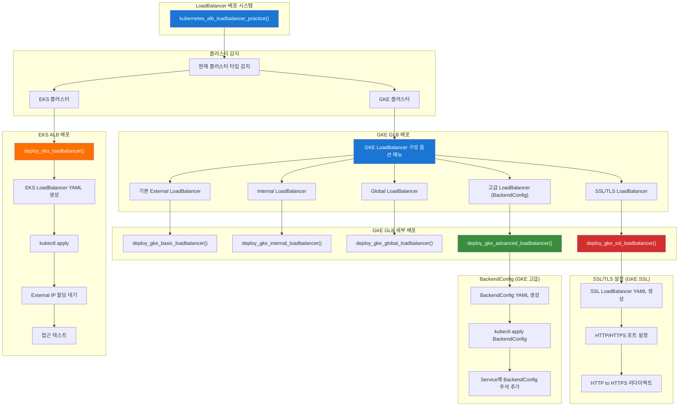
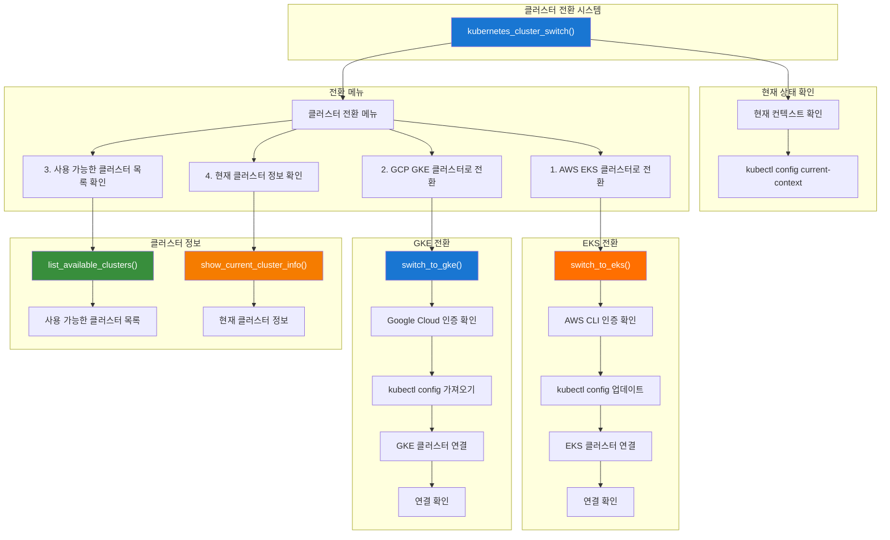

# 🛠️ 자동화 도구 아키텍처

## 📊 자동화 도구 구조 다이어그램

### 🔧 메인 실습 스크립트 아키텍처

```mermaid
flowchart TD
    subgraph "실습 환경"
        U1["사용자"]
        T1["터미널"]
    end
    
    subgraph "메인 스크립트"
        MS["day1-practice.sh<br/>메인 실습 스크립트"]
    end
    
    subgraph "실습 메뉴"
        M1["1. Docker 고급 활용"]
        M2["2. Kubernetes 기초 실습"]
        M3["3. 클라우드 컨테이너 서비스"]
        M4["4. 통합 모니터링 허브"]
    end
    
    subgraph "Kubernetes 서브 메뉴"
        SM1["1. K8s 클러스터 컨텍스트 구성"]
        SM2["2. 클러스터 전환 (EKS ↔ GKE)"]
        SM3["3. Pod 생성 및 관리"]
        SM4["4. Deployment 생성 및 관리"]
        SM5["5. Service 생성 및 관리"]
        SM6["6. ConfigMap 및 Secret 관리"]
        SM7["7. 전체 K8s 리소스 배포"]
        SM8["8. LoadBalancer 서비스 배포"]
        SM9["9. NodePort 서비스 배포"]
        SM10["10. Ingress 설정"]
        SM11["11. 포트 포워딩 테스트"]
        SM12["12. 리소스 상태 확인"]
    end
    
    subgraph "클러스터 관리"
        CM1["kubernetes_context_setup()"]
        CM2["kubernetes_cluster_switch()"]
        CM3["switch_to_eks()"]
        CM4["switch_to_gke()"]
    end
    
    subgraph "리소스 배포"
        RD1["kubernetes_pod_practice()"]
        RD2["kubernetes_deployment_practice()"]
        RD3["kubernetes_service_practice()"]
        RD4["kubernetes_config_secret_practice()"]
        RD5["kubernetes_all_resources_practice()"]
    end
    
    subgraph "외부 접근"
        EA1["kubernetes_nodeport_practice()"]
        EA2["kubernetes_alb_loadbalancer_practice()"]
        EA3["kubernetes_ingress_practice()"]
        EA4["kubernetes_port_forward_practice()"]
    end
    
    subgraph "LoadBalancer 배포"
        LB1["deploy_eks_loadbalancer()"]
        LB2["deploy_gke_loadbalancer()"]
        LB3["deploy_gke_basic_loadbalancer()"]
        LB4["deploy_gke_internal_loadbalancer()"]
        LB5["deploy_gke_global_loadbalancer()"]
        LB6["deploy_gke_advanced_loadbalancer()"]
        LB7["deploy_gke_ssl_loadbalancer()"]
    end
    
    subgraph "문제 해결"
        TS1["eks-lb-troubleshoot.sh"]
        TS2["diagnose()"]
        TS3["fix()"]
        TS4["test()"]
    end
    
    U1 --> T1
    T1 --> MS
    MS --> M1
    MS --> M2
    MS --> M3
    MS --> M4
    
    M2 --> SM1
    M2 --> SM2
    M2 --> SM3
    M2 --> SM4
    M2 --> SM5
    M2 --> SM6
    M2 --> SM7
    M2 --> SM8
    M2 --> SM9
    M2 --> SM10
    M2 --> SM11
    M2 --> SM12
    
    SM1 --> CM1
    SM2 --> CM2
    CM2 --> CM3
    CM2 --> CM4
    
    SM3 --> RD1
    SM4 --> RD2
    SM5 --> RD3
    SM6 --> RD4
    SM7 --> RD5
    
    SM8 --> EA2
    SM9 --> EA1
    SM10 --> EA3
    SM11 --> EA4
    
    EA2 --> LB1
    EA2 --> LB2
    LB2 --> LB3
    LB2 --> LB4
    LB2 --> LB5
    LB2 --> LB6
    LB2 --> LB7
    
    SM12 --> TS1
    TS1 --> TS2
    TS1 --> TS3
    TS1 --> TS4
    
    style MS fill:#1976d2,color:#ffffff
    style M2 fill:#388e3c,color:#ffffff
    style SM8 fill:#f57c00,color:#ffffff
    style LB1 fill:#d32f2f,color:#ffffff
    style LB2 fill:#d32f2f,color:#ffffff
    style TS1 fill:#7b1fa2,color:#ffffff
```



### 🔧 LoadBalancer 배포 아키텍처



### 🔧 문제 해결 도구 아키텍처

```mermaid
flowchart TD
    subgraph "문제 해결 시스템"
        TS["eks-lb-troubleshoot.sh"]
    end
    
    subgraph "진단 모드"
        DIAG["diagnose"]
        DIAG1["클러스터 연결 확인"]
        DIAG2["Pod 상태 확인"]
        DIAG3["Service 상태 확인"]
        DIAG4["엔드포인트 확인"]
        DIAG5["보안 그룹 확인"]
        DIAG6["ALB 상태 확인"]
    end
    
    subgraph "자동 수정 모드"
        FIX["fix"]
        FIX1["보안 그룹 규칙 추가"]
        FIX2["LoadBalancer 재생성"]
        FIX3["External IP 할당 대기"]
        FIX4["접근 테스트"]
    end
    
    subgraph "테스트 모드"
        TEST["test <URL>"]
        TEST1["HTTP 접근 테스트"]
        TEST2["응답 시간 측정"]
        TEST3["상태 코드 확인"]
        TEST4["오류 진단"]
    end
    
    subgraph "보안 그룹 관리"
        SG1["HTTP 포트 80 추가"]
        SG2["HTTPS 포트 443 추가"]
        SG3["NodePort 범위 추가"]
        SG4["방화벽 규칙 확인"]
    end
    
    subgraph "LoadBalancer 관리"
        LB1["기존 LoadBalancer 삭제"]
        LB2["새 LoadBalancer 생성"]
        LB3["External IP 할당 대기"]
        LB4["접근성 테스트"]
    end
    
    TS --> DIAG
    TS --> FIX
    TS --> TEST
    
    DIAG --> DIAG1
    DIAG --> DIAG2
    DIAG --> DIAG3
    DIAG --> DIAG4
    DIAG --> DIAG5
    DIAG --> DIAG6
    
    FIX --> FIX1
    FIX --> FIX2
    FIX --> FIX3
    FIX --> FIX4
    
    TEST --> TEST1
    TEST --> TEST2
    TEST --> TEST3
    TEST --> TEST4
    
    FIX1 --> SG1
    FIX1 --> SG2
    FIX1 --> SG3
    FIX1 --> SG4
    
    FIX2 --> LB1
    FIX2 --> LB2
    FIX2 --> LB3
    FIX2 --> LB4
    
    style TS fill:#7b1fa2,color:#ffffff
    style DIAG fill:#1976d2,color:#ffffff
    style FIX fill:#388e3c,color:#ffffff
    style TEST fill:#f57c00,color:#ffffff
    style SG1 fill:#d32f2f,color:#ffffff
    style LB1 fill:#ff6f00,color:#ffffff
```



### 🔧 클러스터 전환 아키텍처



## 🎯 자동화 도구 활용 가이드

### 📋 단계별 사용법

#### 1. 메인 실습 스크립트 실행
```bash
# 실습 스크립트 실행
cd /home/ec2-user/mcp-cloud-workspace/mcp_cloud/cloud_intermediate/repo/automation/day1
./day1-practice.sh
```

#### 2. Kubernetes 기초 실습 선택
```bash
# 메뉴에서 "2. Kubernetes 기초 실습" 선택
# 서브 메뉴가 나타남
```

#### 3. 클러스터 Context 구성
```bash
# "1. K8s 클러스터 컨텍스트 구성 및 체크" 선택
# 자동으로 클러스터 연결 상태 확인
```

#### 4. 클러스터 전환
```bash
# "2. 클러스터 전환 (EKS ↔ GKE)" 선택
# EKS ↔ GKE 클러스터 간 전환 가능
```

#### 5. LoadBalancer 배포
```bash
# "8. LoadBalancer 서비스 배포 (EKS ALB / GKE GLB)" 선택
# 현재 클러스터 타입에 따라 자동으로 적절한 LoadBalancer 배포
```

#### 6. 문제 해결
```bash
# LoadBalancer 접근 문제 발생 시
./eks-lb-troubleshoot.sh diagnose    # 문제 진단
./eks-lb-troubleshoot.sh fix         # 자동 해결
./eks-lb-troubleshoot.sh test <URL>  # 접근 테스트
```

### 🔧 고급 기능

#### GKE LoadBalancer 구성 옵션
```bash
# GKE 클러스터에서 LoadBalancer 배포 시
# 1. 기본 External LoadBalancer
# 2. Internal LoadBalancer
# 3. Global LoadBalancer
# 4. 고급 LoadBalancer (BackendConfig 포함)
# 5. SSL/TLS LoadBalancer
```

#### 자동화 스크립트 커스터마이징
```bash
# 스크립트 수정을 통한 커스터마이징
vim day1-practice.sh
vim eks-lb-troubleshoot.sh
```

### 📊 성능 모니터링

#### 실시간 상태 확인
```bash
# Pod 상태 모니터링
kubectl get pods -n day1-practice -w

# Service 상태 모니터링
kubectl get service -n day1-practice -w

# LoadBalancer External IP 할당 모니터링
kubectl get service myapp-service-lb -n day1-practice -w
```

#### 리소스 사용량 확인
```bash
# Pod 리소스 사용량
kubectl top pods -n day1-practice

# 노드 리소스 사용량
kubectl top nodes
```

---

**💡 자동화 도구를 활용하여 효율적으로 실습을 진행하세요!**  
**문제가 발생하면 자동화 도구의 진단 기능을 먼저 사용해보세요.**
