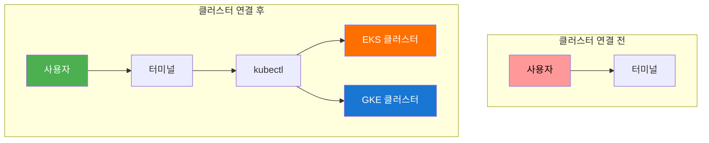
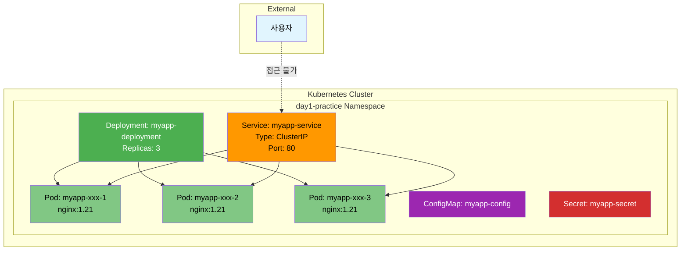
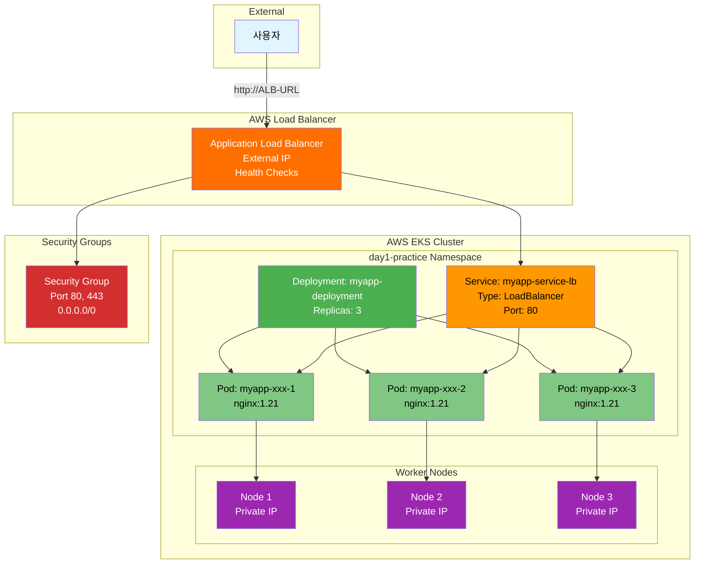
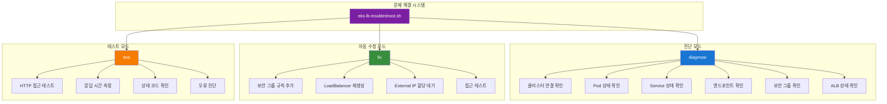

# 🚀 Kubernetes 기초 실습 통합 가이드

## 📋 실습 진행 순서 및 아키텍처 변화

### 🔧 1단계: 클러스터 Context 구성

#### 명령어 단위 실행
```bash
# AWS EKS 클러스터 연결
aws configure list
aws sts get-caller-identity
aws eks update-kubeconfig --region ap-northeast-2 --name cloud-intermediate-eks
kubectl config current-context
kubectl cluster-info
kubectl get nodes

# GCP GKE 클러스터 연결
gcloud auth list
gcloud config set project YOUR_PROJECT_ID
gcloud container clusters get-credentials cloud-intermediate-gke --region asia-northeast1
kubectl config current-context
kubectl cluster-info
kubectl get nodes

# 클러스터 전환
kubectl config get-contexts
kubectl config use-context arn:aws:eks:ap-northeast-2:ACCOUNT:cluster/cloud-intermediate-eks
kubectl config use-context gke_PROJECT_ID_REGION_cloud-intermediate-gke
```

#### 자동화 도구 사용
```bash
# 실습 스크립트 실행
cd /home/ec2-user/mcp-cloud-workspace/mcp_cloud/cloud_intermediate/repo/automation/day1
./day1-practice.sh

# 메뉴 선택:
# 2. Kubernetes 기초 실습
# 1. K8s 클러스터 컨텍스트 구성 및 체크
# 2. 클러스터 전환 (EKS ↔ GKE)
```

#### 아키텍처 변화


### 🔧 2단계: Workload 배포

#### 명령어 단위 실행
```bash
# 네임스페이스 생성
mkdir -p day1-kubernetes-basics
cd day1-kubernetes-basics

cat > namespace.yaml << 'EOF'
apiVersion: v1
kind: Namespace
metadata:
  name: day1-practice
  labels:
    name: day1-practice
    environment: learning
---
apiVersion: v1
kind: ResourceQuota
metadata:
  name: compute-quota
  namespace: day1-practice
spec:
  hard:
    requests.cpu: "2"
    requests.memory: 4Gi
    limits.cpu: "4"
    limits.memory: 8Gi
    pods: "10"
EOF

kubectl apply -f namespace.yaml
kubectl get namespaces
kubectl describe namespace day1-practice

# Pod 생성
cat > myapp-pod.yaml << 'EOF'
apiVersion: v1
kind: Pod
metadata:
  name: myapp-pod
  namespace: day1-practice
  labels:
    app: myapp
spec:
  containers:
  - name: myapp
    image: nginx:1.21
    ports:
    - containerPort: 80
    resources:
      requests:
        memory: "64Mi"
        cpu: "250m"
      limits:
        memory: "128Mi"
        cpu: "500m"
    livenessProbe:
      httpGet:
        path: /
        port: 80
      initialDelaySeconds: 30
      periodSeconds: 10
    readinessProbe:
      httpGet:
        path: /
        port: 80
      initialDelaySeconds: 5
      periodSeconds: 5
EOF

kubectl apply -f myapp-pod.yaml
kubectl get pods -n day1-practice
kubectl describe pod myapp-pod -n day1-practice
kubectl logs myapp-pod -n day1-practice

# Deployment 생성
cat > myapp-deployment.yaml << 'EOF'
apiVersion: apps/v1
kind: Deployment
metadata:
  name: myapp-deployment
  namespace: day1-practice
  labels:
    app: myapp
spec:
  replicas: 3
  selector:
    matchLabels:
      app: myapp
  template:
    metadata:
      labels:
        app: myapp
    spec:
      containers:
      - name: myapp
        image: nginx:1.21
        ports:
        - containerPort: 80
        resources:
          requests:
            memory: "64Mi"
            cpu: "250m"
          limits:
            memory: "128Mi"
            cpu: "500m"
        livenessProbe:
          httpGet:
            path: /
            port: 80
          initialDelaySeconds: 30
          periodSeconds: 10
        readinessProbe:
          httpGet:
            path: /
            port: 80
          initialDelaySeconds: 5
          periodSeconds: 5
EOF

kubectl apply -f myapp-deployment.yaml
kubectl get deployment -n day1-practice
kubectl describe deployment myapp-deployment -n day1-practice
kubectl get pods -n day1-practice -l app=myapp

# Service 생성
cat > myapp-service.yaml << 'EOF'
apiVersion: v1
kind: Service
metadata:
  name: myapp-service
  namespace: day1-practice
  labels:
    app: myapp
spec:
  type: ClusterIP
  ports:
  - port: 80
    targetPort: 80
    protocol: TCP
  selector:
    app: myapp
EOF

kubectl apply -f myapp-service.yaml
kubectl get service -n day1-practice
kubectl describe service myapp-service -n day1-practice
kubectl get endpoints -n day1-practice

# ConfigMap 및 Secret 생성
cat > myapp-configmap.yaml << 'EOF'
apiVersion: v1
kind: ConfigMap
metadata:
  name: myapp-config
  namespace: day1-practice
data:
  database_url: "mysql://localhost:3306/mydb"
  app_name: "Cloud Intermediate App"
  environment: "learning"
  log_level: "info"
EOF

cat > myapp-secret.yaml << 'EOF'
apiVersion: v1
kind: Secret
metadata:
  name: myapp-secret
  namespace: day1-practice
type: Opaque
data:
  username: YWRtaW4=  # admin (base64 encoded)
  password: cGFzc3dvcmQ=  # password (base64 encoded)
  api_key: YWJjZGVmZ2hpams=  # abcdefghijk (base64 encoded)
EOF

kubectl apply -f myapp-configmap.yaml
kubectl apply -f myapp-secret.yaml
kubectl get configmaps -n day1-practice
kubectl get secrets -n day1-practice
kubectl describe configmap myapp-config -n day1-practice
kubectl describe secret myapp-secret -n day1-practice
```

#### 자동화 도구 사용
```bash
# 실습 스크립트 실행
./day1-practice.sh

# 메뉴 선택:
# 2. Kubernetes 기초 실습
# 3. Pod 생성 및 관리
# 4. Deployment 생성 및 관리
# 5. Service 생성 및 관리
# 6. ConfigMap 및 Secret 관리
# 7. 전체 K8s 리소스 배포
```

#### 아키텍처 변화


### 🔧 3단계: 외부 접근 구성

#### 명령어 단위 실행
```bash
# NodePort Service 생성
cat > myapp-service-nodeport.yaml << 'EOF'
apiVersion: v1
kind: Service
metadata:
  name: myapp-service-np
  namespace: day1-practice
  labels:
    app: myapp
spec:
  type: NodePort
  ports:
  - port: 80
    targetPort: 80
    nodePort: 30080
    protocol: TCP
  selector:
    app: myapp
EOF

kubectl apply -f myapp-service-nodeport.yaml
kubectl get service myapp-service-np -n day1-practice
kubectl get nodes -o wide
curl http://NODE_IP:30080

# EKS ALB LoadBalancer 생성
cat > myapp-service-loadbalancer.yaml << 'EOF'
apiVersion: v1
kind: Service
metadata:
  name: myapp-service-lb
  namespace: day1-practice
  labels:
    app: myapp
spec:
  type: LoadBalancer
  ports:
  - port: 80
    targetPort: 80
    protocol: TCP
  selector:
    app: myapp
EOF

kubectl apply -f myapp-service-loadbalancer.yaml
kubectl get service myapp-service-lb -n day1-practice
kubectl get service myapp-service-lb -n day1-practice -w

EXTERNAL_IP=$(kubectl get service myapp-service-lb -n day1-practice -o jsonpath='{.status.loadBalancer.ingress[0].hostname}')
curl -I http://$EXTERNAL_IP

# GKE GLB LoadBalancer 생성
cat > myapp-service-gke-lb.yaml << 'EOF'
apiVersion: v1
kind: Service
metadata:
  name: myapp-service-gke-lb
  namespace: day1-practice
  labels:
    app: myapp
  annotations:
    cloud.google.com/load-balancer-type: "External"
spec:
  type: LoadBalancer
  ports:
  - port: 80
    targetPort: 80
    protocol: TCP
  selector:
    app: myapp
EOF

kubectl apply -f myapp-service-gke-lb.yaml
kubectl get service myapp-service-gke-lb -n day1-practice
kubectl get service myapp-service-gke-lb -n day1-practice -w

EXTERNAL_IP=$(kubectl get service myapp-service-gke-lb -n day1-practice -o jsonpath='{.status.loadBalancer.ingress[0].ip}')
curl -I http://$EXTERNAL_IP

# Ingress 설정 (EKS ALB)
cat > myapp-ingress.yaml << 'EOF'
apiVersion: networking.k8s.io/v1
kind: Ingress
metadata:
  name: myapp-ingress
  namespace: day1-practice
  annotations:
    kubernetes.io/ingress.class: "alb"
    alb.ingress.kubernetes.io/scheme: internet-facing
    alb.ingress.kubernetes.io/target-type: ip
    alb.ingress.kubernetes.io/listen-ports: '[{"HTTP": 80}]'
spec:
  rules:
  - host: myapp.example.com
    http:
      paths:
      - path: /
        pathType: Prefix
        backend:
          service:
            name: myapp-service
            port:
              number: 80
EOF

kubectl apply -f myapp-ingress.yaml
kubectl get ingress -n day1-practice
kubectl describe ingress myapp-ingress -n day1-practice

# 포트 포워딩 테스트
kubectl port-forward service/myapp-service 8080:80 -n day1-practice
curl http://localhost:8080
```

#### 자동화 도구 사용
```bash
# 실습 스크립트 실행
./day1-practice.sh

# 메뉴 선택:
# 2. Kubernetes 기초 실습
# 8. LoadBalancer 서비스 배포 (EKS ALB / GKE GLB)
# 9. NodePort 서비스 배포
# 10. Ingress 설정
# 11. 포트 포워딩 테스트
```

#### 아키텍처 변화


### 🔧 4단계: 문제 해결 및 최적화

#### 명령어 단위 실행
```bash
# LoadBalancer 문제 진단
kubectl get pods -n day1-practice
kubectl describe pods -n day1-practice
kubectl get service -n day1-practice
kubectl describe service myapp-service-lb -n day1-practice
kubectl get endpoints -n day1-practice

# 보안 그룹 확인 (EKS)
aws eks describe-cluster --name cloud-intermediate-eks --query 'cluster.resourcesVpcConfig.securityGroupIds'
aws ec2 describe-security-groups --group-ids sg-xxxxxxxxx

# 방화벽 규칙 추가 (필요시)
aws ec2 authorize-security-group-ingress --group-id sg-xxxxxxxxx --protocol tcp --port 80 --cidr 0.0.0.0/0
aws ec2 authorize-security-group-ingress --group-id sg-xxxxxxxxx --protocol tcp --port 443 --cidr 0.0.0.0/0

# 성능 최적화
kubectl top pods -n day1-practice
kubectl top nodes
kubectl scale deployment myapp-deployment --replicas=5 -n day1-practice
kubectl autoscale deployment myapp-deployment --cpu-percent=50 --min=3 --max=10 -n day1-practice
```

#### 자동화 도구 사용
```bash
# 문제 해결 스크립트 실행
./eks-lb-troubleshoot.sh diagnose    # 종합 진단
./eks-lb-troubleshoot.sh fix         # 문제 자동 해결
./eks-lb-troubleshoot.sh test <URL>  # 접근 테스트

# 실습 스크립트 실행
./day1-practice.sh

# 메뉴 선택:
# 2. Kubernetes 기초 실습
# 12. 리소스 상태 확인
```

#### 아키텍처 변화


### 🔧 5단계: 실습 정리

#### 명령어 단위 실행
```bash
# 자동 정리
kubectl delete namespace day1-practice

# 개별 리소스 삭제
kubectl delete deployment myapp-deployment -n day1-practice
kubectl delete service myapp-service -n day1-practice
kubectl delete service myapp-service-lb -n day1-practice
kubectl delete configmap myapp-config -n day1-practice
kubectl delete secret myapp-secret -n day1-practice

# 정리 확인
kubectl get all -n day1-practice
kubectl get namespaces
```

#### 자동화 도구 사용
```bash
# 실습 스크립트 실행
./day1-practice.sh

# 메뉴에서 "정리" 옵션 선택
```

## 📊 실습 진행 상황 체크리스트

### ✅ 1단계: 클러스터 Context 구성
- [ ] AWS EKS 클러스터 연결
- [ ] GCP GKE 클러스터 연결
- [ ] 클러스터 전환 테스트
- [ ] 자동화 도구를 통한 Context 관리

### ✅ 2단계: Workload 배포
- [ ] 네임스페이스 생성
- [ ] Pod 생성 및 관리
- [ ] Deployment 생성 및 관리
- [ ] Service 생성 및 관리
- [ ] ConfigMap 및 Secret 관리
- [ ] 자동화 도구를 통한 리소스 배포

### ✅ 3단계: 외부 접근 구성
- [ ] NodePort Service 배포
- [ ] EKS ALB LoadBalancer 배포
- [ ] GKE GLB LoadBalancer 배포
- [ ] Ingress 설정
- [ ] 포트 포워딩 테스트
- [ ] 자동화 도구를 통한 LoadBalancer 배포

### ✅ 4단계: 문제 해결 및 최적화
- [ ] LoadBalancer 문제 진단
- [ ] 네트워크 연결 테스트
- [ ] 성능 최적화
- [ ] 자동화 도구를 통한 문제 해결

### ✅ 5단계: 실습 정리
- [ ] 자동 정리 실행
- [ ] 수동 정리 확인
- [ ] 리소스 정리 완료
- [ ] 자동화 도구를 통한 정리

## 🎯 학습 성과 확인

### 실습 완료 체크리스트
- [ ] Kubernetes 클러스터 Context 구성 완료
- [ ] Pod, Deployment, Service, ConfigMap, Secret 관리 완료
- [ ] LoadBalancer 외부 접근 구성 완료
- [ ] 문제 해결 및 최적화 완료
- [ ] 자동화 도구 활용 완료

### 다음 단계
- **클라우드 컨테이너 서비스** 실습으로 진행
- **통합 모니터링 허브** 구축 실습 준비
- **AWS ECS** 및 **GCP Cloud Run** 실습

---

**💡 명령어 단위 실행과 자동화 도구를 모두 활용하여 효율적으로 실습을 진행하세요!**  
**문제가 발생하면 자동화 도구의 진단 기능을 먼저 사용해보세요.**
